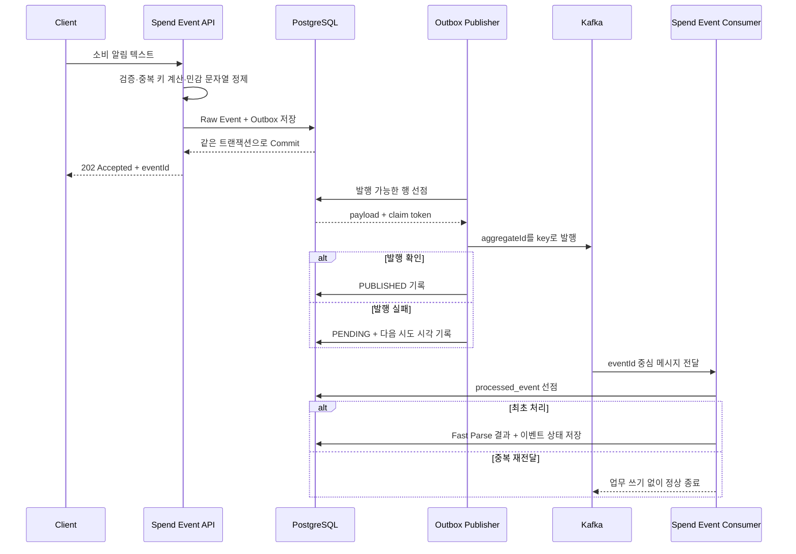

# 백엔드 컴포넌트 가이드

이 문서는 현재 구현된 소비 이벤트 접수, Outbox 발행, Kafka 소비와 빠른 분석 코드가
왜 필요한지 설명한다.
클래스 이름을 다시 풀어 쓰는 목록이 아니라, 어떤 문제를 해결하기 위해 경계를 나눴고
각 컴포넌트를 없앴을 때 무엇이 깨지는지를 기준으로 정리했다.

## 이 기능을 먼저 만든 이유

SpendGuard의 분석·예산·위험 탐지는 입력 데이터가 안전하게 남아 있다는 전제에서만
의미가 있다. 금융 알림이 유실되거나 같은 결제가 두 번 반영되면 이후 분석 정확도가
높아도 사용자는 결과를 신뢰할 수 없다. 그래서 첫 백엔드 범위는 AI 분류보다 앞단인
다음 문제를 해결하는 데 집중했다.

- 금융 알림 텍스트를 빠르게 접수하고 후속 분석과 분리한다.
- 재전송된 알림이 원천 데이터에 중복 저장되지 않게 한다.
- 저장 성공과 이벤트 발행 요청 사이의 유실 구간을 없앤다.
- Kafka가 잠시 중단되어도 접수 API는 데이터를 보존한다.
- 여러 발행 작업자가 동시에 실행돼도 같은 Outbox 행을 덮어쓰지 않게 한다.
- 저장·로그·메시지 브로커에 금융 원문이 불필요하게 복제되는 범위를 줄인다.

## 현재 제공하는 기능

| 기능 | 사용자에게 주는 효과 | 구현 방식 |
|---|---|---|
| 소비 알림 접수 | 분석 완료를 기다리지 않고 빠르게 접수 결과를 받는다 | `POST /api/v1/spend-events`, `202 Accepted` |
| 입력 검증 | 비어 있거나 지나치게 긴 메시지가 저장소까지 들어가지 않는다 | Bean Validation과 Problem Details 응답 |
| 민감 문자열 정제 | 이메일과 카드·계좌 번호 형태가 원문 그대로 저장될 가능성을 줄인다 | 규칙 기반 마스킹 후 정제본만 저장 |
| 중복 접수 방지 | 네트워크 재시도나 같은 알림 재전송이 한 건으로 처리된다 | 결정적 SHA-256 키와 PostgreSQL 고유 제약 |
| 원자적 이벤트 기록 | 데이터는 저장됐지만 분석 이벤트가 사라지는 상태를 막는다 | 원천 이벤트와 Outbox를 하나의 DB 트랜잭션으로 저장 |
| 비동기 Kafka 발행 | Kafka 지연이나 장애가 접수 API로 전파되지 않는다 | 스케줄러가 Outbox를 별도로 선점해 발행 |
| 다중 작업자 선점 | 인스턴스가 늘어나도 같은 유효 임대가 중복 처리되지 않는다 | `FOR UPDATE SKIP LOCKED`, claim token, 임대 만료 |
| 실패 재시도 | 일시적인 브로커 실패를 자동으로 다시 처리한다 | 제한이 있는 지수 백오프와 다음 시도 시각 저장 |
| Consumer 중복 방지 | Kafka가 같은 이벤트를 다시 보내도 분석 결과가 한 번만 반영된다 | `processed_event` 고유 제약과 원자적 선점 |
| 빠른 필수값 분석 | AI 응답을 기다리기 전에 금액과 거래유형을 구조화한다 | 버전이 있는 결정론적 원화·키워드 파서 |
| 검토 사유 보존 | 모호한 알림을 임의로 확정하지 않고 확인 대상으로 남긴다 | `NEEDS_REVIEW` 상태와 안정적인 사유 코드 |
| Consumer 실패 격리 | 잘못된 메시지나 반복 실패가 정상 메시지 처리를 막지 않는다 | 고정 간격 재시도와 Dead Letter Topic |
| 운영 확인 | 업무 데이터를 만들지 않고 프로세스 응답 여부를 확인한다 | `GET /api/v1/status` |

## 한 건의 알림이 처리되는 과정

접수 응답은 “분석 완료”가 아니라 “원천 이벤트와 발행 요청이 안전하게 저장됨”을 뜻한다.
이 의미를 분리해야 느린 AI 분석이나 외부 서비스 장애가 사용자의 입력 자체를 잃게 하지 않는다.

## 컴포넌트를 나눈 기준

### 실행과 공통 지원

| 컴포넌트 | 담고 있는 기능 | 별도로 필요한 이유 |
|---|---|---|
| `SpendingGuardApplication` | Spring Boot 시작과 전체 모듈 조립 | 실행 방식이 업무 규칙에 섞이지 않게 한다 |
| `ServiceStatusController` | 부작용 없는 HTTP 상태 응답 | 업무 API를 호출하지 않고 프로세스 liveness를 확인한다 |
| `TimeConfiguration` | UTC `Clock` 제공 | 시간 경계 로직을 고정 시계로 재현하고 서버 시간대 차이를 제거한다 |

### 소비 이벤트 API

| 컴포넌트 | 담고 있는 기능 | 별도로 필요한 이유 |
|---|---|---|
| `SpendEventController` | 요청 접수, `202`와 `Location` 응답 | HTTP 표현과 유스케이스를 분리한다 |
| `SubmitSpendEventRequest` | 외부 입력 형식과 검증, 명령 변환 | 검증 애노테이션이 애플리케이션 계층으로 퍼지는 것을 막는다 |
| `SpendEventAcceptedResponse` | 공개 가능한 접수 결과만 반환 | 내부 모델이나 향후 필드가 API 계약에 그대로 노출되지 않게 한다 |
| `SpendEventExceptionHandler` | 중복·입력 오류를 일관된 Problem Details로 변환 | 컨트롤러가 예외별 응답 조립 코드로 비대해지는 것을 막는다 |

### 소비 이벤트 애플리케이션

| 컴포넌트 | 담고 있는 기능 | 별도로 필요한 이유 |
|---|---|---|
| `SubmitSpendEventUseCase` | 수집 채널이 호출하는 접수 계약 | HTTP 외의 연동 채널도 같은 기능을 호출할 수 있게 한다 |
| `SubmitSpendEventCommand` | 전송 기술과 무관한 접수 입력 | 웹 DTO를 서비스 내부 표준 입력으로 사용하지 않게 한다 |
| `SpendEventService` | 정규화, 중복 키, 정제, 원천 이벤트와 Outbox 저장 | 접수 트랜잭션의 순서와 원자성을 한곳에서 통제한다 |
| `SpendEventReceipt` | 트랜잭션 완료 후 반환할 결과 | 애플리케이션 결과가 HTTP 응답 형식에 종속되지 않게 한다 |
| `StoreRawSpendEventPort` | 정제된 원천 이벤트 저장 계약 | 서비스가 JPA와 PostgreSQL 예외를 직접 알지 않게 한다 |
| `AppendSpendEventOutboxPort` | 접수 완료 이벤트 기록 계약 | Outbox 테이블과 JSON 직렬화 방식을 서비스에서 숨긴다 |
| `DuplicateSpendEventException` | 중복 접수라는 업무 의미 | DB 고유 제약 오류를 저장 기술과 무관한 충돌 의미로 바꾼다 |

### 소비 이벤트 도메인

| 컴포넌트 | 담고 있는 기능 | 별도로 필요한 이유 |
|---|---|---|
| `RawSpendEvent` | 정제된 원천 데이터와 처리 상태 | 후속 분석이 의존할 저장 직전의 도메인 형태를 고정한다 |
| `SpendEventSource` | 이벤트 유입 채널 | 중복 키의 네임스페이스와 채널별 정책 분기 기준이 된다 |
| `SpendEventStatus` | 업무 처리 단계 | 메시지 전달 상태와 소비 데이터의 상태를 섞지 않는다 |
| `SpendEventReceived` | 접수 완료를 알리는 최소 이벤트 | 금융 원문을 브로커에 복제하지 않고 후속 작업을 시작한다 |
| `DeduplicationKeyGenerator` | 외부 ID 우선의 결정적 SHA-256 키 | 사전 조회 없이 DB 고유 제약으로 동시 중복을 판정하게 한다 |
| `MessageSanitizer` | 공백 정규화와 알려진 민감 패턴 치환 | 저장 전 최소한의 개인정보 보호 경계를 한곳에 둔다 |

### 소비 이벤트 인프라

| 컴포넌트 | 담고 있는 기능 | 별도로 필요한 이유 |
|---|---|---|
| `SpendEventDomainConfiguration` | 순수 도메인 정책을 Spring 빈으로 조립 | 정책 코드에 프레임워크 의존성을 넣지 않는다 |
| `RawSpendEventEntity` | `raw_spend_event` 컬럼과 고유 제약 매핑 | JPA와 테이블 규칙이 도메인 모델로 퍼지지 않게 한다 |
| `RawSpendEventJpaRepository` | 원천 이벤트 기본 영속성 연산 | Spring Data 의존성을 영속성 패키지 안에 가둔다 |
| `RawSpendEventPersistenceAdapter` | 저장, 즉시 flush, 중복 예외 변환 | 고유 제약 위반을 현재 트랜잭션 안에서 도메인 오류로 바꾼다 |
| `SpendEventAnalysisPersistenceAdapter` | 분석 입력 조회와 원천 이벤트 상태 변경 | 분석 모듈이 원천 이벤트 JPA 엔티티에 직접 의존하지 않게 한다 |

### 빠른 분석 애플리케이션과 도메인

| 컴포넌트 | 담고 있는 기능 | 별도로 필요한 이유 |
|---|---|---|
| `ProcessSpendEventUseCase` | Kafka 이외의 입력원도 호출할 수 있는 처리 계약 | 메시징 기술과 분석 유스케이스를 분리한다 |
| `ProcessSpendEventCommand` | 원천 이벤트 식별자 기반 처리 명령 | Kafka DTO를 애플리케이션 표준 입력으로 사용하지 않게 한다 |
| `SpendEventProcessingService` | 선점, 조회, 파싱, 저장, 상태 변경의 트랜잭션 | 중간 실패 시 선점까지 롤백되는 멱등 처리 경계를 한곳에 둔다 |
| `SpendEventAnalysisTarget` | 분석에 필요한 정제 메시지와 발생 시각 | 원천 이벤트 엔티티 전체가 분석 계층으로 노출되지 않게 한다 |
| `SpendEventProcessingResult` | 처리, 검토, 중복 건의 안정적인 결과 | 인프라 예외나 DB 갱신 수를 유스케이스 결과로 노출하지 않는다 |
| `LoadSpendEventForAnalysisPort` | 분석 입력 조회 계약 | 분석 서비스가 원천 이벤트 저장 기술을 알지 않게 한다 |
| `StoreFastParseResultPort` | 버전이 있는 빠른 분석 결과 저장 계약 | 결과 테이블과 JPA 사용 여부를 서비스에서 숨긴다 |
| `TryClaimProcessedEventPort` | Consumer별 처리 권한 선점 계약 | 멱등성 구현을 단순 메모리 캐시가 아닌 영속성 경계에 위임한다 |
| `UpdateSpendEventStatusPort` | 원천 이벤트 상태 변경 계약 | 분석 모듈이 원천 이벤트 엔티티를 직접 수정하지 않게 한다 |
| `SpendEventNotFoundException` | 메시지가 가리키는 원천 이벤트 부재 | 재시도·DLQ 정책이 판별할 수 있는 안정적인 실패 의미를 만든다 |
| `FastSpendEventParser` | 원화 금액과 거래유형의 결정론적 추출 | 외부 AI 장애 중에도 최소 분석 결과를 재현 가능하게 확보한다 |
| `FastParseOutcome` | 추출 값, 상태, 검토 사유 | 불완전한 입력을 예외나 임의 기본값으로 숨기지 않는다 |
| `FastParseStatus` | `PARSED`, `NEEDS_REVIEW` 구분 | 파서 성공과 사용자 확인 필요 상태를 명시적으로 관리한다 |
| `TransactionType` | 결제, 취소, 환불 구분 | 이후 원장에서 금액의 부호와 보상 관계를 올바르게 결정한다 |

### 빠른 분석 인프라

| 컴포넌트 | 담고 있는 기능 | 별도로 필요한 이유 |
|---|---|---|
| `SpendEventKafkaListener` | 문자열 메시지 역직렬화와 유스케이스 호출 | Kafka 애노테이션과 payload 해석을 애플리케이션 계층에서 격리한다 |
| `SpendEventReceivedMessage` | 버전 1 메시지 스키마 검증 | Producer와 Consumer 계약 변경을 명시적으로 감지한다 |
| `InvalidSpendEventMessageException` | 복구 불가능한 메시지 계약 위반 | 일시적 오류와 구분해 불필요한 재시도 없이 DLQ로 보낸다 |
| `SpendEventConsumerProperties` | 토픽, 그룹, 재시도, DLQ 설정 | 문자열 환경 변수를 시작 시점에 타입과 불변식으로 검증한다 |
| `SpendEventAnalysisConfiguration` | 파서와 오류 처리기 조립 | 재시도·DLQ 정책을 Listener 구현과 분리한다 |
| `ProcessedEventEntity` | Consumer별 처리 이력 매핑 | 재시작 이후에도 멱등성 판단 근거를 보존한다 |
| `ProcessedEventJpaRepository` | `ON CONFLICT DO NOTHING` 원자적 선점 | 조회 후 삽입 경쟁 조건 없이 최초 처리자 한 명을 결정한다 |
| `ProcessedEventPersistenceAdapter` | 갱신 행 수를 선점 성공 여부로 변환 | PostgreSQL SQL 의미를 애플리케이션의 boolean 계약으로 바꾼다 |
| `FastParseResultEntity` | 추출 값, 버전, 검토 사유 컬럼 매핑 | 분석 이력을 재현하고 검토 대상의 이유를 보존한다 |
| `FastParseResultJpaRepository` | 빠른 분석 결과 영속성 연산 | Spring Data 의존성을 영속성 패키지 안에 가둔다 |
| `FastParseResultPersistenceAdapter` | 도메인 결과를 JPA 엔티티로 변환 | 파서와 서비스가 테이블 구조를 알지 않게 한다 |

### Outbox 애플리케이션과 도메인

| 컴포넌트 | 담고 있는 기능 | 별도로 필요한 이유 |
|---|---|---|
| `ClaimOutboxEventsPort` | 배치 크기와 임대 시간 기준 선점 계약 | 서비스가 PostgreSQL 잠금 방식에 의존하지 않게 한다 |
| `PublishOutboxEventPort` | 브로커 발행과 확인 계약 | Kafka 클라이언트 호출을 유스케이스에서 분리한다 |
| `UpdateOutboxEventStatePort` | 성공·실패 상태의 조건부 변경 계약 | 현재 임대 소유자만 결과를 기록한다는 조건을 고정한다 |
| `ClaimedOutboxEvent` | payload와 claim token을 포함한 작업 단위 | 영속성 엔티티 전체를 발행 서비스에 노출하지 않는다 |
| `OutboxPublishPolicy` | 배치, 임대, 재시도 정책 묶음 | 운영 설정을 검증된 애플리케이션 규칙으로 전달한다 |
| `OutboxPublishService` | 선점, 발행, 상태 반영의 배치 흐름 | 개별 실패를 격리하면서 at-least-once 전달을 구현한다 |
| `OutboxPublishBatchResult` | 선점·성공·실패 집계 | 이벤트 내용 없이 처리량과 실패율을 관측하게 한다 |
| `OutboxPublishException` | 안정적인 브로커 실패 코드 | 인프라 예외 메시지나 금융 데이터를 상태 테이블에 남기지 않는다 |
| `OutboxClaimLostException` | 임대 소유권 상실 표시 | 늦은 작업자가 새 작업자의 결과를 덮어쓰는 것을 막는다 |
| `ExponentialRetryBackoff` | 실패 횟수 기반 재시도 지연 | 브로커 장애 중 즉시 재시도 폭주가 발생하지 않게 한다 |

### Outbox 인프라

| 컴포넌트 | 담고 있는 기능 | 별도로 필요한 이유 |
|---|---|---|
| `OutboxPublisherProperties` | 토픽, 배치, 임대, 백오프, 전송 제한 시간 | 문자열 설정을 시작 시점에 타입과 불변식으로 검증한다 |
| `OutboxPublisherConfiguration` | 정책 조립, 스케줄 활성화, 조건부 토픽 생성 | 운영 설정을 애플리케이션 객체로 번역하는 지점을 모은다 |
| `OutboxPublishScheduler` | 주기 실행과 Micrometer 기록 | 발행 유스케이스가 스케줄러와 관측 기술을 알지 않게 한다 |
| `KafkaOutboxEventPublisher` | aggregate key 발행과 브로커 확인 대기 | Kafka 예외와 제한 시간을 안정적인 발행 계약으로 변환한다 |
| `OutboxPersistenceAdapter` | 도메인 이벤트 직렬화와 최초 Outbox 저장 | 접수 트랜잭션에 참여해 원천 데이터와 발행 요청을 함께 커밋한다 |
| `OutboxEventEntity` | payload, 상태, 시도 횟수, 임대, 오류 코드 저장 | 재시작 후에도 발행 수명주기와 복구 정보를 유지한다 |
| `OutboxEventJpaRepository` | 최초 Outbox INSERT | 단순 저장에는 JPA를 사용하고 복잡한 선점 SQL과 역할을 나눈다 |
| `OutboxDispatchPersistenceAdapter` | `SKIP LOCKED` 선점과 claim token 조건부 갱신 | 다중 작업자 환경의 동시성과 장애 복구를 DB에서 보장한다 |
| `OutboxStatus` | `PENDING`, `PROCESSING`, `PUBLISHED` 상태 | 메시지 전달 수명주기를 업무 상태와 독립적으로 관리한다 |

## 이 구조가 보장하는 것과 보장하지 않는 것

현재 구현은 같은 알림의 중복 저장 방지, 원천 이벤트와 Outbox의 원자적 기록,
다중 발행 작업자의 배타적 임대, 일시적인 Kafka 실패 재시도, Consumer 재전달의
중복 반영 방지와 금액·거래유형의 빠른 분석을 보장한다.

Kafka 발행과 DB 상태 변경은 하나의 분산 트랜잭션이 아니므로 메시지는 중복 발행될 수
있다. 이 선택은 유실보다 중복을 허용하는 at-least-once 방식이며, 현재 Consumer는
이벤트 ID와 논리 이름으로 중복 반영을 막는다. 또한 현재 마스킹과 빠른 파서는 알려진
문자열 패턴에 대한 1차 보호·분석 규칙이며 완전한 개인정보 탐지기나 모든 금융 알림
형식을 지원하는 범용 파서가 아니다.

가맹점·카테고리 AI 분류, 예산 원장, 위험 점수, 실제 금융사 연동은 아직 이 코드에 포함되지 않았다.
앞단의 수집과 전달 신뢰성을 먼저 고정한 뒤 후속 기능이 같은 이벤트 계약 위에서
추가되도록 설계했다.
