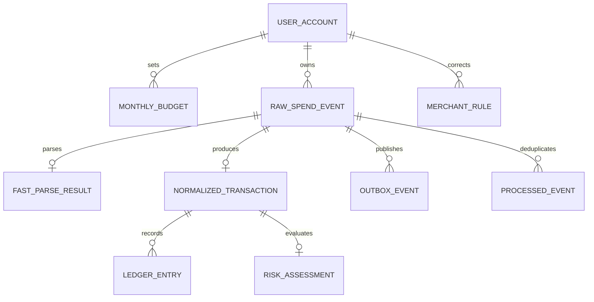

# Data Model

## 1. 개념 모델



## 2. 주요 테이블

### `user_account`

| 컬럼 | 설명 |
|---|---|
| `id` | 내부 UUID |
| `email` | 로그인 식별자, Unique |
| `password_hash` | BCrypt 단방향 해시 |
| `created_at` | 생성 시각 |

이메일은 공백과 대소문자를 정규화한 뒤 저장하며 데이터베이스 고유 제약으로 동시 중복
등록을 차단한다. 평문 비밀번호는 테이블과 API 응답에 남기지 않는다.

### `raw_spend_event`

| 컬럼 | 설명 |
|---|---|
| `id` | 이벤트 UUID |
| `user_id` | 사용자 |
| `source` | MANUAL_TEXT, CSV, SIMULATOR, TOSS_WEBHOOK |
| `external_event_id` | 외부 시스템 식별자, nullable |
| `deduplication_key` | 직접 입력 중복 탐지 해시 |
| `sanitized_message` | 개인정보가 제거된 텍스트 |
| `status` | 처리 상태 |
| `occurred_at` | 실제 발생 추정 시각 |
| `received_at` | 시스템 수신 시각 |

제약:

```text
UNIQUE(source, external_event_id) WHERE external_event_id IS NOT NULL
UNIQUE(user_id, deduplication_key)
```

### `fast_parse_result`

외부 AI 호출 전에 확보한 결정론적 분석 결과다. 금액과 거래유형을 추출할 수 없는 경우에도
행을 남겨 검토 사유를 추적한다.

| 컬럼 | 설명 |
|---|---|
| `raw_event_id` | 원천 이벤트, Primary Key |
| `amount` | 추출한 원화 금액, nullable |
| `transaction_type` | PAYMENT, CANCEL, REFUND, nullable |
| `status` | PARSED, NEEDS_REVIEW |
| `review_reason` | 누락·모호성 사유 코드 |
| `parser_version` | 재현 가능한 규칙 버전 |
| `parsed_at` | 빠른 분석 완료 시각 |

`PARSED` 상태는 금액과 거래유형이 모두 있어야 하며, `NEEDS_REVIEW`는 반드시 검토
사유를 가진다. 이 조건은 애플리케이션뿐 아니라 데이터베이스 CHECK 제약으로도 확인한다.

### `normalized_transaction`

| 컬럼 | 설명 |
|---|---|
| `id` | 정규화 거래 UUID |
| `raw_event_id` | 원본 이벤트, Unique |
| `amount` | 절댓값 금액 |
| `currency` | 기본 KRW |
| `transaction_type` | PAYMENT, CANCEL, REFUND |
| `merchant` | 추출된 가맹점 |
| `normalized_merchant` | 정규화 가맹점 |
| `category` | 소비 카테고리 |
| `confidence` | 분류 신뢰도 |
| `analysis_version` | Parser·Prompt 버전 |

### `ledger_entry`

| 컬럼 | 설명 |
|---|---|
| `id` | 원장 항목 UUID |
| `event_id` | 소비 이벤트 |
| `user_id` | 사용자 |
| `transaction_id` | 정규화 거래 |
| `entry_type` | PAYMENT, CANCEL, REFUND |
| `signed_amount` | 결제 양수, 취소·환불 음수 |
| `reversal_of_entry_id` | 원거래 원장 항목 |
| `occurred_at` | 거래 발생 시각 |

제약:

```text
UNIQUE(event_id, entry_type)
CHECK(signed_amount <> 0)
```

원장 행은 UPDATE 또는 DELETE하지 않는다. 정정은 보상 원장 항목으로 표현한다.

### `monthly_budget`

| 컬럼 | 설명 |
|---|---|
| `user_id` | 사용자 |
| `budget_month` | YYYY-MM |
| `category` | 카테고리 |
| `budget_amount` | 설정 예산 |
| `spent_amount` | 원장 기반 Projection |
| `version` | 낙관적 충돌 관찰용 버전 |

제약:

```text
UNIQUE(user_id, budget_month, category)
CHECK(budget_amount >= 0)
```

### `risk_assessment`

| 컬럼 | 설명 |
|---|---|
| `transaction_id` | 거래, Unique |
| `score` | 0~100 |
| `level` | LOW, MEDIUM, HIGH |
| `signals` | 계산 근거 JSON |
| `policy_version` | 위험 정책 버전 |
| `evaluated_at` | 평가 시각 |

### `processed_event`

| 컬럼 | 설명 |
|---|---|
| `event_id` | 처리 대상 이벤트 |
| `consumer_name` | Consumer 논리 이름 |
| `processed_at` | 처리 완료 시각 |

제약:

```text
UNIQUE(event_id, consumer_name)
```

### `outbox_event`

| 컬럼 | 설명 |
|---|---|
| `id` | Outbox UUID |
| `aggregate_type` | 집합 타입 |
| `aggregate_id` | 집합 식별자 |
| `event_type` | 이벤트 타입 |
| `payload` | 버전 필드를 포함한 JSON |
| `status` | PENDING, PUBLISHED |
| `attempt_count` | 발행 시도 횟수 |
| `created_at` | 생성 시각 |
| `published_at` | 발행 시각 |

### `merchant_rule`

사용자 수정 결과를 재사용한다.

```text
UNIQUE(user_id, normalized_merchant)
```

## 3. Projection 갱신

Lost Update를 막기 위해 읽기-계산-쓰기 대신 원자적 SQL을 사용한다.

```sql
UPDATE monthly_budget
SET spent_amount = spent_amount + :signedAmount,
    version = version + 1
WHERE user_id = :userId
  AND budget_month = :budgetMonth
  AND category = :category;
```

## 4. 정합성 대조

주기적으로 원장 합계와 `monthly_budget.spent_amount`를 비교한다. 불일치는 자동 은폐하지 않고 측정값과 함께 운영 이벤트로 남긴다.
