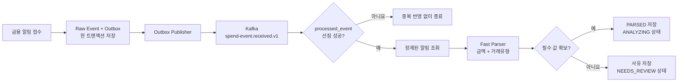

# Spend Event Processing

## 현재 구현 흐름

## 이 단계를 먼저 두는 이유

LLM 분류는 가맹점 정규화와 카테고리 판단에 유용하지만 응답 지연과 외부 장애가 있다.
금액과 결제·취소·환불 유형처럼 원장 정합성에 직접 영향을 주는 값은 단순하고 재현 가능한
규칙으로 먼저 추출한다. 규칙이 판단하지 못한 입력은 억지로 채우지 않고 검토 대상으로
남긴다.

## 재전달과 동시성

Kafka는 처리 결과에 따라 같은 이벤트를 다시 전달할 수 있다. Consumer는 업무 데이터를
쓰기 전에 `(event_id, consumer_name)`을 PostgreSQL에 삽입한다. `ON CONFLICT DO NOTHING`의
결과가 1인 요청만 후속 처리를 수행하므로 여러 인스턴스가 동시에 같은 이벤트를 받아도
한 건만 반영된다.

선점, 빠른 분석 결과 저장, 원천 이벤트 상태 변경은 같은 데이터베이스 트랜잭션에 참여한다.
중간 단계가 실패하면 선점 기록도 롤백되어 다음 Kafka 재전달이 안전하게 다시 시도할 수 있다.

## 실패 처리

| 실패 유형 | 처리 |
|---|---|
| 지원하지 않는 스키마·깨진 JSON | 재시도 없이 DLQ 이동 |
| 일시적 데이터베이스·애플리케이션 오류 | 일정 간격으로 재시도 |
| 재시도 소진 | DLQ 이동 |
| 금액 또는 거래유형 미확정 | 정상 저장 후 `NEEDS_REVIEW` |

DLQ 적재 이후의 재처리 API와 운영 화면은 별도 작업으로 추가한다.

## 검증 결과를 보는 곳

GitHub Actions의 `Backend CI` 실행 요약에서 전체 테스트 통과율, 빠른 파서 회귀
데이터셋 정확도, 라인·브랜치 커버리지를 확인할 수 있다. 클래스별 결과와 커버리지 상세는
실행 artifact의 HTML 보고서에서 확인한다.
