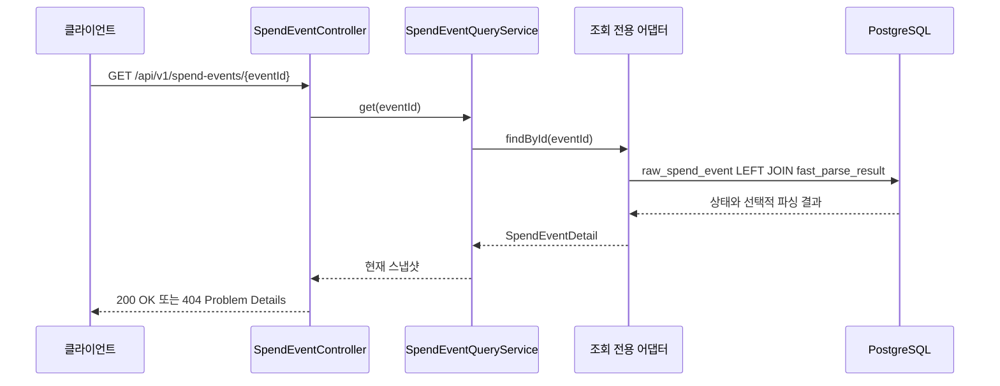

# 소비 이벤트 상태 조회

소비 알림 접수 API는 후속 분석을 기다리지 않고 `202 Accepted`를 반환한다. 조회 API는 응답의 `eventId` 또는 `Location`을 사용해 비동기 처리 상태와 현재까지 확보한 빠른 파싱 결과를 확인하게 한다.

## 설계 판단

- 접수 직후처럼 분석 결과가 아직 없는 이벤트도 반환하기 위해 `LEFT JOIN`을 사용한다.
- 쓰기 엔티티에 조회 편의용 연관관계를 추가하지 않고 조회 전용 포트와 JDBC 어댑터를 둔다.
- 한 번의 쿼리로 응답을 구성해 지연 로딩과 N+1 조회 가능성을 제거한다.
- `fastParse=null`은 실패가 아니라 아직 분석되지 않은 정상 상태다.
- 존재하지 않는 이벤트는 `404 application/problem+json`, 잘못된 UUID는 `400 application/problem+json`으로 구분한다.

프론트엔드는 `Location`을 따라 이 API를 조회하고, `RECEIVED`·`ANALYZING` 상태에는 처리 중 안내를, `COMPLETED`에는 분석 완료 결과를, `NEEDS_REVIEW`에는 사용자 확인 화면을 표시한다.

