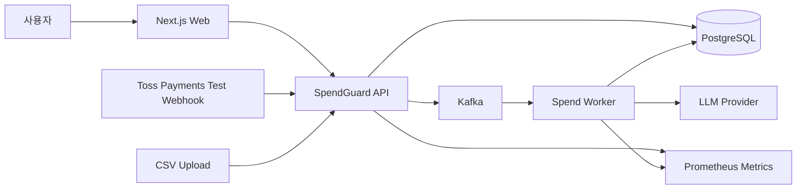
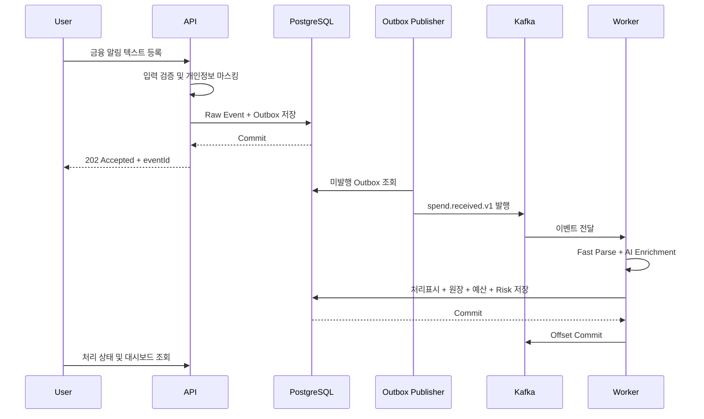
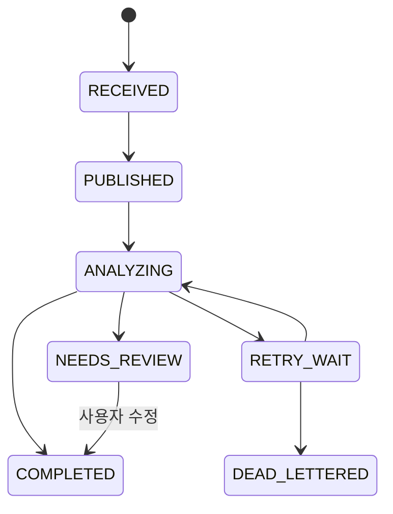

# System Context and Runtime Flow

현재 구현된 소비 이벤트 접수와 Outbox 클래스의 도입 이유와 책임은
[백엔드 컴포넌트 가이드](backend-components.md)에 정리한다.

## 1. 시스템 경계

SpendGuard는 소비 이벤트를 수집·분석하는 서비스다. 실제 결제를 승인하거나 은행 계좌에서 자금을 이동하지 않는다.

## 2. 내부 모듈

| 모듈 | 책임 |
|---|---|
| `auth` | 사용자 인증과 권한 |
| `ingestion` | 입력 검증, 마스킹, Raw Event와 Outbox 저장 |
| `analysis` | Fast Parser, LLM 분류, Fallback |
| `ledger` | 승인·취소·환불 append-only 원장 |
| `budget` | 월간·카테고리 예산 Projection |
| `risk` | 버전 관리되는 규칙 평가와 근거 생성 |
| `reporting` | 대시보드, 일간 집계, 정합성 대조 |
| `integration` | CSV, Toss Payments, 미래 Open Banking Adapter |

## 3. 실행 프로필

하나의 코드베이스를 사용하되 다음 프로필을 지원하도록 설계한다.

- `api`: HTTP API, 조회, Outbox Publisher
- `worker`: Kafka Consumer, 분석, 원장, 예산, Risk
- `local`: 작은 개발 환경에서 API와 Worker를 한 프로세스로 실행

프로필 분리는 향후 Worker만 독립적으로 확장할 수 있게 하지만, MVP를 여러 마이크로서비스로 쪼개지는 않는다.

## 4. 소비 이벤트 처리 흐름

## 5. 처리 상태

## 6. 장애 경계

### Kafka 장애

- API는 Raw Event와 Outbox를 PostgreSQL에 저장한다.
- Kafka 발행 실패는 Outbox에 남고 복구 후 재발행한다.
- 사용자의 입력 응답은 Kafka 직접 호출에 의존하지 않는다.

### LLM 장애

- 금액·거래유형 Fast Parser 결과는 유지한다.
- TimeLimiter, Bulkhead, Circuit Breaker를 적용한다.
- 알려진 가맹점은 규칙으로 분류한다.
- 확신이 낮은 결과는 `NEEDS_REVIEW`로 둔다.

### Worker 장애

- DB 커밋 전에 실패하면 Kafka가 재전달한다.
- DB 커밋 후 Offset 커밋 전에 실패해도 `processed_event` 유니크 제약이 중복 반영을 막는다.

## 7. 프론트엔드 조회 방식

- MVP는 이벤트 상세 Polling을 사용한다.
- 대시보드는 Projection 테이블을 조회한다.
- 실시간성이 더 필요하다는 측정 근거가 생기면 SSE를 추가한다.
