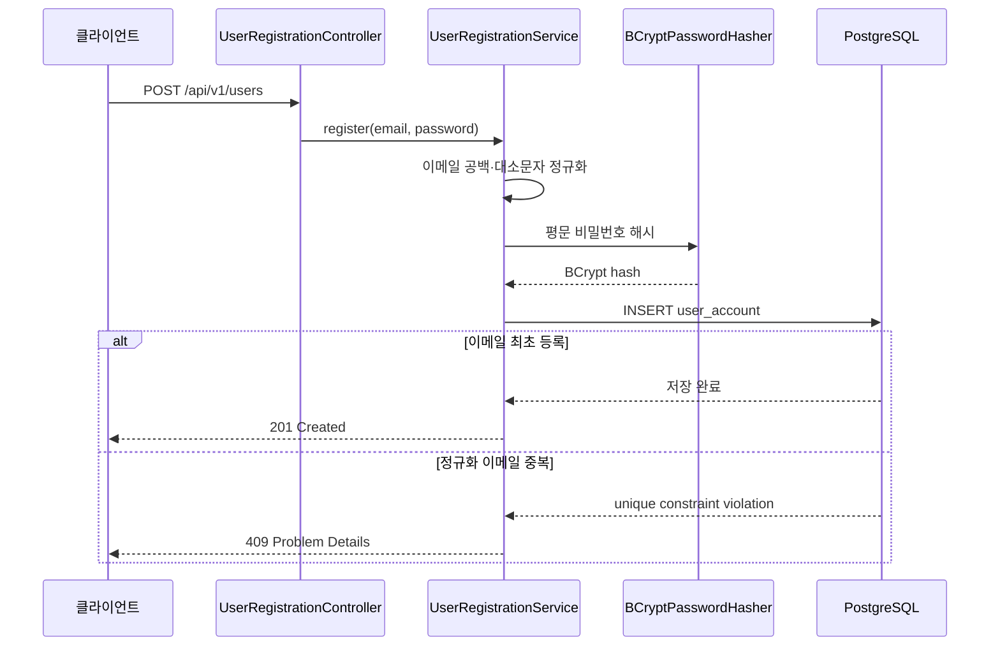

# 회원 등록

예산과 소비 이벤트를 사용자 소유 데이터로 연결하기 전에 계정 식별 경계를 만든다. 현재 범위는 회원 등록이며 로그인과 접근 토큰 발급은 다음 인증 작업으로 분리한다.

## 설계 판단

- 중복 확인용 선행 SELECT를 사용하지 않고 PostgreSQL 고유 제약을 최종 판정 기준으로 둔다.
- BCrypt work factor 12를 사용하며 입력은 알고리즘 한계에 맞춰 8~72자로 검증한다.
- 애플리케이션 계층은 `HashPasswordPort`에만 의존해 암호화 구현을 교체할 수 있다.
- API 응답에는 사용자 식별자, 정규화 이메일, 생성 시각만 포함한다.
- 같은 이메일의 동시 등록 테스트로 성공 1건과 중복 7건, 최종 저장 1건을 검증한다.

로그인 기능이 추가되기 전까지 생성된 계정을 인증 주체로 사용할 수 없으며, 소비 이벤트와 예산에 사용자 외래 키를 연결하는 작업도 인증 경계 이후에 진행한다.
